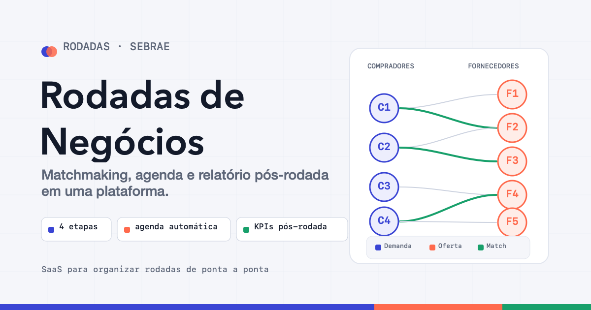

# Rodadas de Negócios · SEBRAE



Este repositório apresenta um **plano de negócio e produto** para uma plataforma de rodadas de negócios. A ideia é transformar um processo que hoje depende de planilhas, conferência manual e muito trabalho operacional em um SaaS simples de operar, com dados organizados, matchmaking estruturado, agenda automática e relatório pós-evento.

## Para Que Serve

A plataforma serve para ajudar o SEBRAE a organizar rodadas de negócios de ponta a ponta.

Em uma rodada, empresas compradoras apresentam suas demandas e fornecedores apresentam suas ofertas. O papel do sistema é cruzar essas informações, sugerir os melhores encontros, montar a agenda e registrar os resultados depois das reuniões.

Na prática, o produto ajuda a responder perguntas como:

- Quais fornecedores combinam melhor com cada comprador?
- Quais reuniões têm maior chance de gerar negócio?
- Como montar uma agenda sem conflito de horários?
- Quem compareceu?
- Quanto de expectativa de venda a rodada gerou?
- Quais setores, compradores e fornecedores tiveram melhor desempenho?

## Problema Que Resolve

Rodadas de negócios geram valor quando compradores e fornecedores certos se encontram no momento certo. O problema é que esse trabalho costuma ser operacionalmente pesado.

Sem uma plataforma, a equipe precisa:

- coletar inscrições em formulários separados;
- organizar demandas e ofertas manualmente;
- comparar compradores e fornecedores caso a caso;
- montar agendas em planilhas;
- evitar conflitos de horário manualmente;
- enviar agendas individuais;
- cobrar respostas pós-rodada;
- consolidar indicadores para prestação de contas.

O SaaS proposto reduz esse esforço e cria um processo mais confiável, rastreável e mensurável.

## Fluxo Do Produto

O plano é dividido em quatro etapas principais:

| Etapa | Nome | Objetivo |
| --- | --- | --- |
| 1 | Cadastro pré-edital | Coletar dados de compradores, fornecedores, demandas, ofertas e documentos |
| 2 | Matchmaking e curadoria | Cruzar demanda e oferta para sugerir os melhores encontros |
| 3 | Geração de agenda | Criar o cronograma da rodada sem conflitos de horário |
| 4 | Relatório pós-rodada | Medir comparecimento, satisfação, próximos passos e expectativa de vendas |

## Como Será O Matchmaking

O matchmaking é o coração da plataforma. Ele cruza o que o comprador quer comprar com o que o fornecedor consegue oferecer.

O sistema gera um **score de compatibilidade** para cada combinação comprador-fornecedor. Esse score não substitui a decisão do SEBRAE: ele organiza as sugestões para que a curadoria humana aprove, recuse ou ajuste os encontros.

Critérios sugeridos para o score:

| Critério | Peso sugerido | O que avalia |
| --- | ---: | --- |
| Categoria do produto | 40% | Se a demanda do comprador bate com a oferta do fornecedor |
| Volume x capacidade | 25% | Se o fornecedor consegue atender o volume desejado |
| Local de entrega | 20% | Se a região ou cobertura logística faz sentido |
| Sinergia | 15% | Se existe afinidade complementar entre as empresas |

Fórmula inicial:

```text
score = 0,40 · categoria
      + 0,25 · volume
      + 0,20 · região
      + 0,15 · sinergia
```

A habilitação do fornecedor funciona como filtro eliminatório. Se a empresa não tiver capacidade técnica, produtiva ou situação fiscal/legal adequada, ela não entra no cruzamento, mesmo que pareça compatível.

## Papel Da Curadoria

O sistema recomenda, mas o SEBRAE decide.

A curadoria continua sendo essencial para:

- aprovar matches sugeridos pelo sistema;
- recusar encontros que não façam sentido;
- criar matches manuais;
- marcar encontros prioritários;
- ajustar critérios por setor ou tipo de rodada;
- garantir qualidade na experiência dos participantes.

Isso mantém a inteligência operacional do SEBRAE no centro do processo, usando o software como apoio para reduzir trabalho manual e aumentar consistência.

## Agenda Automática

Depois que os matches são aprovados, o sistema monta a agenda da rodada.

A agenda precisa resolver um problema importante: ninguém pode estar em duas reuniões ao mesmo tempo. Além disso, cada mesa, horário e participante precisa ser organizado de forma clara.

O sistema deve permitir:

- configurar horários, duração das reuniões e quantidade de mesas;
- gerar a agenda automaticamente;
- impedir conflito de horário;
- priorizar matches com maior score;
- permitir edição manual pelo organizador;
- reenviar agenda quando houver ajuste;
- entregar agenda individual para comprador e fornecedor.

O resultado esperado é que cada participante receba apenas os seus compromissos, com horário, mesa e empresa participante.

## Relatório Pós-Rodada

A última etapa transforma a rodada em dados de negócio.

Depois das reuniões, compradores e fornecedores respondem um formulário, idealmente por reunião. O objetivo é medir não só satisfação, mas também resultado comercial.

Indicadores importantes:

- comparecimento;
- no-show;
- resultado da reunião;
- interesse em seguir negociação;
- próximos passos;
- valor estimado de negócio;
- expectativa de vendas;
- satisfação ou NPS;
- desempenho por setor;
- desempenho por comprador e fornecedor.

Esse relatório ajuda o SEBRAE a demonstrar impacto, prestar contas e melhorar as próximas rodadas.

## Entregas Do MVP

O MVP é organizado em quatro entregas sequenciais:

| Entrega | Conteúdo |
| --- | --- |
| Entrega 1 | Cadastros de compradores, fornecedores, demandas, ofertas, categorias e documentos |
| Entrega 2 | Matchmaking com score, painel de curadoria e aprovação manual |
| Entrega 3 | Criação automática da agenda e envio individual aos participantes |
| Entrega 4 | Relatório pós-rodada com formulários, dashboards e exportação |

## Resultado Esperado

Com a plataforma, a operação da rodada fica mais simples, rápida e mensurável.

O SEBRAE ganha:

- menos trabalho manual;
- mais controle sobre matches e agendas;
- melhor experiência para participantes;
- dados consolidados para tomada de decisão;
- indicadores claros de impacto econômico;
- base histórica para melhorar rodadas futuras.

## Arquivo Principal

O plano visual está no arquivo:

```text
analise-helka.html
```

Ele pode ser aberto diretamente no navegador para apresentar o conceito, fluxo, entregas e método de matchmaking.
